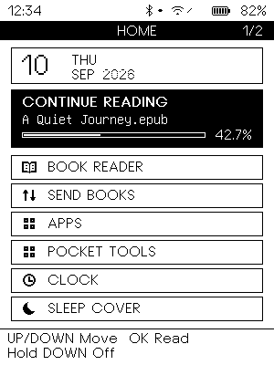
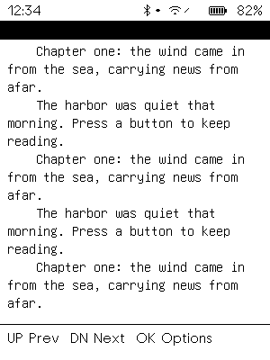
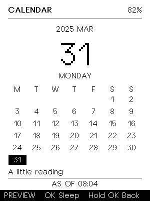
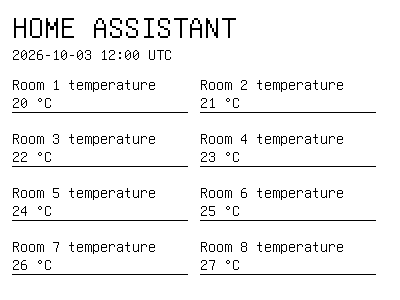
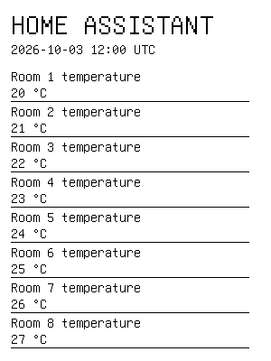

# Note4 Open Platform

English | [简体中文](README_zh.md)

Independent firmware for the black-and-white Note4: ESP32-S3, SSD2683
400×300 e-paper, 16 MiB Flash and 8 MiB PSRAM. Maintained by
[Tinnci](https://github.com/Tinnci). No commercial firmware or LVGL dependency.

[User handbook](docs/HANDBOOK.md) · [Build from source](docs/QUICK_START.md) ·
[Documentation](docs/README.md) · [SDK v2 migration](docs/NOTE4_MIGRATION.md)

## On the screen

| Feature | Landscape | Portrait |
| --- | --- | --- |
| Home — calendar, reading progress and apps |  |  |
| Reader — streamed TXT/EPUB, native reflow |  |  |
| Sleep cover — calendar and daily line |  |  |
| Home Assistant — server-rendered remote page |  |  |

Rendered firmware previews, not device photographs; sample data is illustrative.
[More screens and preview generation](docs/UI_PREVIEW.md).

## What it does

- Read TXT/EPUB books, save progress and install resource-bounded Lua apps.
- Switch orientation, sleep covers and date-digit styles.
- Transfer books/apps over USB or local Wi-Fi; pair with the Android companion.
- Refresh cached pages within wake/radio budgets; optionally use the
  HTTPS/MQTT HA bridge and BTHome battery telemetry.
- Build applications on owned platform services and C++17 SDK v2;
  inspect the device through a bounded maintenance CLI.

Host tests do not establish physical display quality, standby current,
radio behavior or interrupted-OTA recovery.
[Qualification and history](docs/README.md#qualification-and-history).
Source version is **2.0.0**; it does not imply a published release.

## Build and test

Linux and macOS are supported. Install ESP-IDF **5.5.2** for `esp32s3`,
CMake **3.30.5**, ccache, uv and Bun **1.4.2**. Android also uses JDK **21**,
SDK **37.0** and the committed Gradle Wrapper.
[Prerequisites and path overrides](docs/PREREQUISITES.md).

From the repository root:

```bash
source tools/activate-dev-env.sh
tools/check-dev-env.sh
tools/build-firmware.sh --profile full
tools/test-host.sh --jobs 2
```

`full` includes all features; `reader` is an offline reader;
`minimal` keeps clock, settings, sleep covers and diagnostics.
Named profiles use separate build/config directories and preserve local
`sdkconfig`. [Custom configurations](docs/MODULAR_BUILD.md).

Use `tools/test-host.sh --list`, `--suite ui` or `--test reader` for targeted
tests. Android: `tools/test-android-companion.sh`.
See [CI](docs/CI.md) for coverage, reports and sanitizer options.

## Repository

| Path | Purpose |
| --- | --- |
| `main/` | Firmware composition, scenes and bundled assets |
| `components/` | Services, drivers, UI, reader and application runtime |
| `apps/`, `examples/` | Installable Lua apps and SDK example |
| `android-companion/` | Android companion |
| `tools/` | Builds, tests, previews, USB client and optional HA bridge |
| `docs/` | Guides, architecture, APIs and historical evidence |
| `books/` | Optional initial library; not flashed by a normal build |

Generated `build*` directories and logs are ignored, not source deliverables.

## Safety and licensing

**Not compatible with NOTE4C.** Confirm hardware revision and exact serial
port and back up data before flashing. Layout changes need a separate migration;
an application-only update cannot replace the partition table.
Do not erase NVS or initialize the library for an ordinary SDK v2 upgrade.
The new Android package requires fresh enrollment. [Migration details](docs/NOTE4_MIGRATION.md).

NOTE4 and ZECTRIX are product names or trademarks of Zectrix Lab / their
respective owners. This independent community project is not official firmware
and is not affiliated with, sponsored by or endorsed by Zectrix Lab.

Copyright (c) 2026 Zectrix Lab  
Copyright (c) 2026 Tinnci  
[MIT License](LICENSE) · [Third-party notices](THIRD_PARTY_NOTICES.md) ·
[Upstream provenance](UPSTREAM.md) · [Contributing](CONTRIBUTING.md) ·
[Security reports](SECURITY.md)

Thanks to [Zectrix Lab](https://wiki.zectrix.com/) for hardware and reference
firmware, [CrossPoint](https://github.com/crosspoint-reader/crosspoint-reader)
and [Flipper Zero](https://github.com/flipperdevices/flipperzero-firmware) for
design references, and Heavyweight Type Foundry / GNU Unifont for the OFL fonts.
