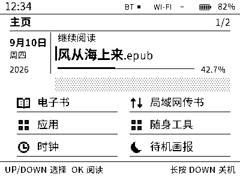
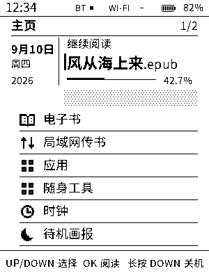
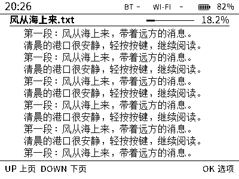
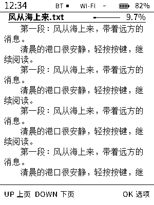
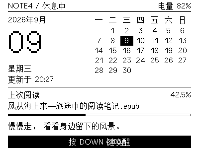
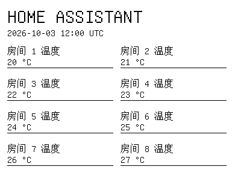
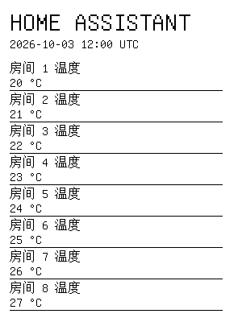

# Note4 开放固件平台

[English](README.md) | 简体中文

面向黑白 Note4 的独立社区固件：ESP32-S3、SSD2683 400×300 墨水屏、
16 MiB Flash、8 MiB PSRAM。由 [Tinnci](https://github.com/Tinnci) 维护，
不依赖商业固件或 LVGL。

[使用手册](docs/HANDBOOK_zh.md) · [源码构建](docs/QUICK_START.md) ·
[文档导航](docs/README.md) · [SDK v2 迁移](docs/NOTE4_MIGRATION.md)

## 界面一览

| 功能 | 横屏 | 竖屏 |
| --- | --- | --- |
| 主页：日历、阅读进度与应用入口 |  |  |
| 阅读器：TXT/EPUB 流式阅读与原生重排 |  |  |
| 日历锁屏：月历与每日短句 |  |  |
| Home Assistant：服务端渲染的远程页面 |  |  |

图片为渲染预览，不是真机照片；日期和数据仅作示例。
[更多界面与预览生成](docs/UI_PREVIEW.md)。

## 功能

- 阅读 TXT/EPUB、保存进度、安装有资源限额的 Lua 应用。
- 切换显示方向、锁屏样式与日期数字风格。
- USB / 局域网 Wi-Fi 传书和安装应用，Android 伴侣配对。
- 按唤醒和无线预算刷新远程页面缓存；可选 HTTPS/MQTT 桥接和
  BTHome 电量广播接入 Home Assistant。
- 平台服务、C++17 SDK v2，以及有界维护 CLI。

主机测试不能代替屏幕效果、待机电流、无线行为和断电 OTA 的真机验证。
参见[验证与历史记录](docs/README.md#qualification-and-history)。
源码版本为 **2.0.0**，不代表已发布可下载版本。

## 构建与测试

支持 Linux 和 macOS。需要 ESP-IDF **5.5.2**（`esp32s3`）、CMake **3.30.5**、
ccache、uv 和 Bun **1.4.2**。Android 另需 JDK **21**、SDK **37.0**，
使用仓库内的 Gradle Wrapper。[环境要求与自定义路径](docs/PREREQUISITES.md)。

在仓库根目录运行：

```bash
source tools/activate-dev-env.sh
tools/check-dev-env.sh
tools/build-firmware.sh --profile full
tools/test-host.sh --jobs 2
```

`full` 包含完整功能，`reader` 为离线阅读器，`minimal` 保留时钟、设置、
锁屏和诊断。预设使用独立构建与配置目录，不修改本地 `sdkconfig`。
[自定义构建](docs/MODULAR_BUILD.md)。

用 `tools/test-host.sh --list` 查看测试，`--suite ui` 或 `--test reader`
运行相关子集。Android 验证：`tools/test-android-companion.sh`。
覆盖范围、报告和 sanitizer 选项见 [CI](docs/CI.md)。

## 目录

| 路径 | 内容 |
| --- | --- |
| `main/` | 固件组装、场景与内置资源 |
| `components/` | 平台服务、驱动、UI、阅读器与应用运行时 |
| `apps/`、`examples/` | 可安装 Lua 应用与 SDK 示例 |
| `android-companion/` | Android 伴侣 |
| `tools/` | 构建、测试、预览、USB 客户端与可选 HA 桥接 |
| `docs/` | 指南、架构、接口说明和历史证据 |
| `books/` | 可选初始书库；普通固件构建不会烧录它 |

生成的 `build*` 目录和日志不纳入源码交付。

## 安全与授权

**不兼容 NOTE4C。** 烧录前确认硬件版本、准确串口并备份数据。
分区布局变化需要单独迁移，不能只更新应用镜像。
普通 SDK v2 升级不要擦除 NVS 或初始化书库；新版 Android 包需要重新配对。
[迁移详情](docs/NOTE4_MIGRATION.md)。

NOTE4 与 ZECTRIX 是 Zectrix Lab / 相关权利人的产品名称或商标。
本项目是独立社区项目，不是官方固件，与 Zectrix Lab 无官方附属、赞助或背书关系。

Copyright (c) 2026 Zectrix Lab  
Copyright (c) 2026 Tinnci  
[MIT License](LICENSE) · [第三方授权](THIRD_PARTY_NOTICES.md) ·
[上游来源](UPSTREAM.md) · [参与贡献](CONTRIBUTING.md) · [安全报告](SECURITY.md)

感谢 [Zectrix Lab](https://wiki.zectrix.com/) 提供硬件与原始参考固件，
[CrossPoint](https://github.com/crosspoint-reader/crosspoint-reader) 与
[Flipper Zero](https://github.com/flipperdevices/flipperzero-firmware) 提供设计参考，
Heavyweight Type Foundry / GNU Unifont 提供 OFL 字体。
