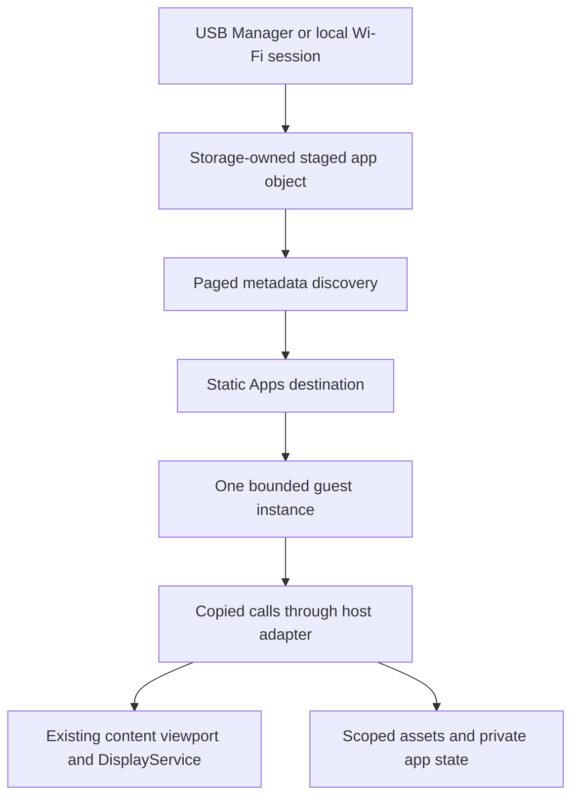

# Dynamic application runtime research

E2.1, source review and experiments: **2026-09-11**.

The preferred next experiment is **WAMR's metered classic interpreter**, with a
small, explicitly supported Wasm module subset. It provides a portable binary
boundary without exposing ESP32 addresses. Text-only Lua is a viable alternative
for personal scripting. Select one backend for a first product experiment;
shipping both would spend scarce firmware space before there are consumers.

Wasm3 v0.5.0 cannot interrupt a tight guest loop through its yield hook. Native
ELF loading can separate distribution from firmware, but cannot isolate native
code from this device's memory or peripherals. Neither is the preferred route
for third-party foreground apps.

This iteration completes the research and reproducible experiments. **The
shipping firmware still runs static SDK v1 applications.** A successful link
does not establish safe arbitrary-code execution: WAMR initialization bypasses
the callback instruction limit, and both Wasm candidates produce the Host
sanitizer findings below. The proposed application format and binary interface
are design directions, not a new frozen contract or compatibility promise.

## Existing constraints and reference designs

The governing boundaries remain [M2](M2_PLATFORM_CONTRACT.md),
[M3](M3_APPLICATION_CONTRACT.md), [SDK v1](SDK_V1.md),
[ADR-0003](adr/0003-freertos-runtime-sdk-boundary.md) and
[USB management](USB_HOST.md). SDK 1.1.1 is a C++17 **source** interface; its
classes, vtables, standard-library types and ESP-IDF services are not a binary
interface for independently compiled applications.

Note4 has an ESP32-S3, 8 MiB octal PSRAM, three 3 MiB application slots and a
4 MiB SPIFFS book partition. PSRAM capacity is not spare executable internal
RAM. The S3 has cache address-mapping hardware, but no separate protected
process address space for each FreeRTOS task. A native task or function can
corrupt the shell regardless of a symbol allowlist.

| Source inspected | Useful behavior | Application to Note4 |
| --- | --- | --- |
| CrossPoint `develop`: [reader][cp-reader], [activities][cp-activities] | Incremental section construction, page-window extension and idle font preparation; pending navigation and a separate render task | Keep native streamed TXT/EPUB pagination and committed bookmarks. A micro-app receives bounded events and performs bounded work; it does not load a book into its VM or replace the existing display owner |
| CrossPoint: [sleep][cp-sleep], [web transfer][cp-web] | Sleep-image fallbacks and overlays; upload buffers, short-write detection and transfer cleanup | Render a cover while awake and retain a static snapshot. Reuse Storage-owned streamed installation and the temporary Wi-Fi session; importing an app must not start it |
| Flipper `dev`: [SceneManager][flipper-scenes], [ViewPort][flipper-viewport] | Handler tables, per-scene state, Back propagation and viewport invalidation | Retain Note4's eight-entry deferred private scene stack, four clipped viewports and shared 15,000-byte canvas. Flipper's synchronous scene transitions, GUI mutexes and application threads are not copied into guest callbacks |
| Flipper: [FAP documentation][flipper-fap], [loader][flipper-loader] | ELF plus metadata/assets, target/API-major checks, import resolution, relocation and thread join before unload | Separate app identity, hardware target and interface version from firmware version. Check compatibility before execution, keep metadata owned, and retire every borrowed resource before unloading |

CrossPoint is a reading/workflow reference, not a Wasm sandbox. Flipper's ARM
FAP binaries cannot execute on Xtensa. Its broad native SDK and generated
symbol-table workflow solve different constraints from Note4's narrow host
boundary. No upstream UI, loader or engine source is vendored into this repo.

## Execution choices

| Route | Feasibility and memory model | Failure containment and maintenance | Decision |
| --- | --- | --- | --- |
| Espressif ELF loader 1.3.3 | [Source][elf-loader] supports ESP32-S3 and PSRAM code mapping. A loaded app needs text/rodata/data/BSS, relocation working memory and native stack; executable internal allocations and cache mappings need separate accounting | No native memory sandbox or reliable forced cleanup after arbitrary writes. The inspected Xtensa relocator handles a limited set of relocation types; an arbitrary toolchain ELF is not automatically supported. Compiler calling convention, pointer width, alignment and imported symbols remain dependencies | Possible trusted developer tools later; no third-party isolation claim. Not built or executed in this experiment, so no fabricated loader-size or device-heap number |
| [Wasm3 v0.5.0][wasm3-exec] | Interpreter, one 64 KiB linear-memory page and a 4 KiB VM stack in this probe; small linked addition and fast Host result | Bounds-checks guest loads, but `m3_Yield` is reached on calls, not every loop backedge. Tight loops need an external process timeout here. Host UBSan also finds an incompatible indirect call | Reject this release/configuration for the foreground third-party route. A watchdog reboot is not an application cancellation mechanism |
| [WAMR 2.4.5][wamr-api] | Classic interpreter, software bounds checks, allocation callbacks and instruction metering; ESP-IDF/Xtensa port exists | Exported callbacks stop on the instruction limit. Start functions and legacy post-instantiation exports can run before that limit is installed. A Host alignment finding needs resolution before this adapter can claim clean cross-platform execution | Preferred compiled-app prototype, subject to the concrete initialization and runtime defects below |
| [Lua 5.4.9][lua-api] | Source text, restricted globals, a custom allocator and coroutine count hook. Much smaller measured guest heap; interpreter code still consumes substantial Flash | Safe script memory is mediated by the VM, but C imports remain native trusted code. Yielding to the C owner prevents a script from catching a timeout as an ordinary Lua error. C calls, parsing and finalization are not bounded by the opcode hook alone | Viable personal-scripting alternative. Accept text only, meter top-level code, and expose a deliberately small set of host functions |

WAMR and Espressif's loader use Apache-2.0 licenses; Wasm3, Lua and CrossPoint
use MIT; Flipper uses GPL-3.0. These are source-root observations, not a license
assessment of every optional dependency, font or app. Experiments fetch engine
release sources into ignored build directories.

The WAMR probe disables AOT/JIT, fast interpreter, WASI/libc imports, guest
threads, shared memory, SIMD, reference types, bulk memory, GC and memory64.
It does not reserve a desktop-sized virtual address region or rely on a Host
fault handler for bounds checks. AOT/JIT would add architecture/toolchain and
executable-memory concerns without a measured Note4 need.

## Executed experiments

[`tools/runtime-research`](../tools/runtime-research) builds the actual upstream
engines. The normal Wasm input is 311 bytes, compiled from WAT by wasmtime
48.0.0; wasmtime is a fixture compiler, not the execution engine being measured.
The Lua source performs the same small workload: sum 1–64, call a bounded host
import with `NOTE4`, and return 2080. This checks an event-like crossing; it is
not an EPUB or UI performance benchmark.

Each normal run checks 10,000 calls, invalid import arguments, malformed input,
allocation exhaustion, cleanup after failure and 100 complete load/call/unload
cycles. Wasm also exercises denied `memory.grow`, out-of-bounds access and
recursive execution failure. Wasm3's recursion experiment has the yield hook
armed, so its failure alone does not prove native stack-overflow protection.
The Lua allocation-exhaustion call deliberately disables the instruction hook
to reach the allocator limit independently of the CPU limit.

The probe now resets Wasm3's yield counter before module initialization, owns
WAMR's writable input until unload, protects Lua bootstrap allocation and meters
Lua's top-level chunk. Logs distinguish normal and sanitizer builds, assertions
include source locations, and sanitizer failures terminate the process rather
than being reported as successful measurements.

### Host memory and time

Host: macOS 15.7.9, x86_64 process, Apple Clang 17.0.0, release builds with
`-Os`. Values count requested bytes through the probe allocator. They exclude allocation headers,
native stack, immutable input, platform allocations and process RSS. WAMR's
writable input copy is included. These are **not ESP32-S3 heap measurements**.

| Engine | Peak tracked bytes before exhaustion test | Live after every close | 10,000 calls, microseconds | Allocation limit |
| --- | ---: | ---: | ---: | ---: |
| Wasm3 | 76,549 | 0 | 4,832 | 256 KiB; failed load also tested at 32 KiB |
| WAMR | 75,301 | 0 | 21,165 | 256 KiB; failed load also tested at 32 KiB |
| Lua | 9,061 | 0 | 39,078 | 64 KiB; failed creation also tested at 1 KiB |

Timing is a single Host observation and includes each adapter's function lookup,
stack reset and budget setup. The language instruction sets, implementation
strategies and interpreter options differ. Do not convert these numbers into
ESP32 page-turn latency or expected battery life. Lua's separate exhaustion run
reaches 41,448 tracked bytes before an allocation is refused.

### Cancellation and initialization

| Case | Wasm3 | WAMR | Lua |
| --- | --- | --- | --- |
| Infinite event callback | Host killed the process after 2 seconds | Trapped at 10,000 instructions | Yielded to the C owner at the count hook |
| Infinite module initialization | Host killed the process after 2 seconds | Host killed the process after 2 seconds | Yielded to the C owner at the count hook |
| Infinite `__post_instantiate` export | Not exercised | Host killed the process after 2 seconds | Not applicable |

The timeout marker is emitted before the relevant operation. A timeout before
that marker is an experiment failure, not evidence about guest execution. Only
the isolated Host process is stopped; these hostile fixtures are never run by
the production firmware or flashed onto the board.

WAMR's [`execute_post_instantiate_functions`][wamr-init] creates/uses an execution
environment inside instantiation. Installing a limit on a later execution
environment cannot control it. A first loader must either use an upstream
mechanism that meters this phase, or reject start sections and automatic
initialization exports before instantiation. Banning only a start section is
insufficient: `__post_instantiate` also hangs this configuration. WASI and bulk
memory enable further initialization paths and would need their own review.
This is admission at the code-execution boundary, not a repository build gate.

The proposed app has explicit host-invoked initialization and no automatic
constructors. Parsing itself is bounded by module bytes and total allocation,
and still needs cancellation-latency measurement on S3. Instruction limits do
not preempt synchronous native imports: filesystem operations must use bounded
chunks, and networking must submit a request and return to the shell.

### Sanitizer findings

The restricted Lua probe passes ASan/UBSan, including initialization yield,
syntax error, failed creation and cleanup. Full ASan/UBSan probes of the exact
Wasm releases **fail**, with recovery disabled:

- Wasm3: `m3_env.c:208`, invocation of `v_FindFunction` through an incompatible
  function-pointer type.
- WAMR: `wasm_interp_classic.c:6835`, a `WASMBranchBlock` placed at a four-byte
  cell boundary although the 64-bit Host structure requires eight-byte
  alignment. The allocation itself is correctly aligned.

The WAMR finding depends on this Host representation and does not establish
that the same access fails on 32-bit Xtensa. It also cannot be dismissed as a
clean portable C execution. These are reproducible upstream integration
findings, not suppressed diagnostics or modified upstream sources. Resolve
them with an appropriate upstream version/fix before relying on the Host VM
adapter for product verification. The normal 35-target firmware Host suite
passes independently and does not contain these experimental engines.

### ESP32-S3 link measurements

ESP-IDF 5.5.2 and Xtensa GCC 14.2.0 build an isolated Full image for each engine.
`research_probe` is retained through a linker reference, so unused-code removal cannot reduce the
measurement to an empty component. It is never called by `app_main`. The image
contains the probe, hostile fixture bytes and allocator, so the difference is
an integration estimate, not just a claimed upstream core-library size.

| Image | Firmware bytes | Addition to Full | Static internal RAM | Remaining in 3 MiB slot |
| --- | ---: | ---: | ---: | ---: |
| Full without a probe | 3,027,232 | — | 213,575 | 118,496 |
| Full + Wasm3 probe | 3,091,184 | 63,952 | 213,799 | 54,544 |
| Full + WAMR probe | 3,091,264 | 64,032 | 213,847 | 54,464 |
| Full + Lua probe | 3,107,024 | 79,792 | 213,607 | 38,704 |

Static internal RAM uses ESP-IDF's `used_dram + used_iram + used_diram`, as in
[the existing profile comparison](MODULAR_BUILD.md). It includes linked
internal code/data and excludes runtime heap and PSRAM allocation. Link success
does not measure guest startup, cache behavior, stack high-water marks or free
internal heap during Wi-Fi/display activity. The report does not claim those
unperformed device measurements.

The scripts generate images without changing partitions or flashing. The
research link target reports the resulting slot fit; ordinary firmware builds
retain their existing image/partition checks. A production adapter, installation
UI and additional fonts would consume more than these probes. All three fit,
but WAMR leaves only 54,464 bytes and Lua 38,704 bytes in the current Full slot.
Lua's lower guest heap therefore does not imply the smaller firmware addition.

## A binary boundary beside SDK v1

Keep SDK v1 for built-in C++ apps. Add an internal guest adapter that implements
`sdk::Application`; the guest never receives its address, `ApplicationContext`,
a vtable, `Platform`, an ESP-IDF handle or a FreeRTOS object.

For Wasm, a versioned import namespace such as `zectrix_v1` is the binary
boundary. Firmware resolves those imports to a small C dispatch table. A native
C jump table could later serve trusted ELF code, but Wasm receives imports,
not a table of host addresses. Lua would wrap the same operations as functions
without promising compatibility for serialized Lua bytecode.

The first implementation should define only operations used by real example
apps: copied input/time snapshots, bounded monochrome drawing, read-only app
assets, small private saved state, render intent and deferred Back/Home. Reader,
radio, enrollment, OTA, arbitrary files and raw display controls do not become
available merely because their firmware components are present.

| Concern | Proposed rule |
| --- | --- |
| Interface identity | Separate package-format version, binary-interface major/minor and application version. Firmware version and SDK v1 version are not substitutes |
| Calls and values | Fixed-width integers and explicit status values. Wasm strings/buffers are offsets plus lengths; check `offset <= memory_size` and `length <= memory_size - offset` before translating and copying |
| Native table evolution | A fixed-width major/minor and table-size prefix; append compatible entries, preserve existing semantics and check availability before use. A table still depends on the native target calling convention |
| Compatibility | Reject an unknown major, unsupported feature or missing required import before executing code. Additive minor support cannot silently change an older operation |
| Ownership | Copy commands and display data into bounded host storage before returning to the guest. Resource handles are host-owned, scoped to the foreground lifetime and invalidated on exit |
| Errors | Convert engine traps, exhausted budgets and host errors to the existing SDK status/fallback path. Never let an engine error jump across a C++ lifecycle frame |
| Evidence | Run the same independently built example binaries against two firmware revisions and test missing imports/optional modules. Ordinary versioning and scenario tests are sufficient; no SDK symbol hash or generated API-review gate is proposed |

An initial module should expose explicit init/event/idle/render/exit entry
points, all under instruction budgets. A timeout ends the callback and retires
the instance; it is not a transparent continuation unless that behavior is
deliberately implemented. Exit is best-effort and bounded. Host resource cleanup
always runs, including when guest exit traps or initialization only partly
completed.

## Discovery, installation and lifetime

Use one optional static **Apps** destination, with private List/Details/Running
scenes and one guest adapter. The current 16-entry application catalog is
borrowed for the runtime's lifetime; adding/removing descriptors while it is
active would invalidate SDK ownership assumptions. A paged app list inside one
destination avoids changing that contract or consuming one static slot for
every installed app.



This is a proposed flow; E1.8 currently accepts only books and supported device
settings. App installation needs separate typed operations. Keep book name and
format validation intact, preserve unknown-operation rejection, and negotiate
the new host capability. The USB worker continues copying one request for the
foreground owner; it never invokes a loader or modifies Storage itself.

Prefer a single uncompressed Wasm object with a bounded metadata custom section
for the first prototype. It can hold a stable app ID, display name, app version,
interface requirement, resource limits and required host features. Avoid an
archive extractor, arbitrary paths and installation scripts. The suffix and
exact fields remain undecided until the first working application needs them.

Storage should own an app namespace on the existing filesystem through a
dedicated interface. SPIFFS has flat object names, so a path-like prefix is not
an isolation mechanism. Resolve app assets through host handles, not guest paths.
Do not widen `BookStorage::ValidName` to accept executable objects. Separate app
storage selection from Reader/font selection so a runtime profile need not
link the e-book engine just to mount its files.

Installation follows the existing useful pattern: one management lease,
declared length, ordered 1 KiB chunks, staged write, flush/close and publication
only after a complete, valid object exists. Copy bounded metadata into the list;
do not keep pointers into USB buffers or a temporary parser. Disconnected or
cancelled transfers are not discoverable apps and never execute.

For updates, retain the previous complete version while uploading a new
ID/version object. Reject replacement/removal of a running instance. Select the
new version only after publication and use an NVS commit for any persisted
selection; keep the previous version until that succeeds. A boot scan ignores
unfinished staging objects and validates selected objects before offering them.
SPIFFS flush/rename is not a proven power-failure transaction: test interrupted
publication and selection, and retain a visible recovery choice. No new hash,
journal or partition redesign is needed to explore this with existing IDs,
versions, exclusive ownership and staged files.

| Transition | Owner behavior |
| --- | --- |
| Discovery | Read a bounded page of metadata; skip invalid objects with an explicit reason. No executable code runs during boot scanning |
| Launch | Copy the chosen ID/version and resolve compatibility. Create the inactive C++ adapter before exiting the current app; allocate/load the VM during Enter after the old app has exited |
| Entry failure | Follow the existing Launcher fallback. The current SDK does not preserve the old application after its Exit, so VM allocation failure during Enter cannot promise to resume it |
| Active | Deliver copied events on the foreground owner. Guest private pages use bounded scene state; no background application task or guest render thread |
| Drawing | Validate a bounded draw batch and clip it to the content viewport. Compose with the status bar and commit through DisplayService. Guest code requests Fast/Quality intent, never waveforms or framebuffer ownership |
| Back, Home or trap | Resolve after the callback, discard outgoing render work and close scoped handles. Cleanup does not depend on a successful guest callback |
| Shutdown | Stop the guest and release its region before platform shutdown. A custom cover, if later supported, must already be a validated host-owned snapshot; no guest executes during deep sleep |

This preserves CrossPoint-style cooperative work and Flipper-style private
scenes while respecting Note4's deferred ownership. Reading positions still
commit only after successful physical presentation. Installing a micro-app
does not create a network session, start periodic drawing or change radio
arbitration and shutdown cleanup.

## Initial budgets and next implementation

The following are **starting limits for a prototype**, not measured production
capacity or a permanent ABI. Tighten or revise them using real app workloads.

| Resource | Starting allocation |
| --- | --- |
| Executable object | At most 64 KiB, including metadata; assets read in bounded chunks |
| Wasm guest memory | One fixed 64 KiB page; no shared memory or memory growth |
| VM lifetime region | 256 KiB total in PSRAM for loaded bytes, interpreter structures and guest memory; reserve internal native stack separately |
| Wasm operand/control stack | 4 KiB, as exercised by the probe; native stack high-water remains to be measured |
| Host draw data | At most 4 KiB and 64 operations per frame, copied into host memory; reuse the existing canvas |
| File handles and private state | Four host-owned handles and at most 64 KiB saved app data |
| Guest CPU | Start with 10,000 instructions per callback, then measure event/exit latency on S3; native imports have independent bounded work |
| Discovery | One small page of copied metadata, stable ID/version selection; no unbounded global descriptor array |

Use a per-instance region/pool to make whole-instance reclamation predictable.
WAMR supports a supplied pool or allocator. This does **not** mean zero internal
fragmentation or guaranteed allocation success. The current experiments use
accounted malloc/realloc and prove zero tracked live bytes after the tested
lifetimes; they do not measure long-running pool fragmentation. Keep the shell,
input, display and shutdown allocations outside the guest budget, and measure
the largest available internal block as well as total free PSRAM on device.

The next implementation should resolve WAMR initialization metering/admission
and the Host alignment issue, then run two independently built small apps
(for example a calculator and flashcards) through one optional adapter. Exercise
actual drawing, button/Back handling, missing services, quota failures, malformed
objects and repeated launch/exit before expanding imports. Keep EPUB parsing,
Wi-Fi transfer and sleep-cover composition in their existing native services.

After that, add typed USB installation/discovery and verify disconnect,
duplicate-ID/version, active-file removal and interrupted publication through
the existing Host storage/transport tests. Reuse current Full/Minimal builds.
An S3 trial should measure startup, native stack, peak/largest-block heap and
input-to-cancellation delay with display and radio active. None of these device
measurements blocks completion of this research iteration.

A public app store, signing infrastructure, background apps, arbitrary network
access and trusted ELF support are later product decisions. A first local app
pilot needs explicit local install/launch and ordinary compatibility/resource
checks, not a store service or a new firmware release gate.

## Reproduction and verification

From the repository root:

```bash
# Fetch the named releases only when they are missing; execute Host experiments.
uv run --script tools/runtime-research/run.py --fetch

# Add isolated Full-image links. No probe runs on the board and nothing is flashed.
source tools/activate-dev-env.sh
uv run --script tools/runtime-research/run.py --idf
bash tools/build-firmware.sh --profile full

# Restricted Lua passes; the exact Wasm releases reproduce the findings above.
uv run --script tools/runtime-research/run.py --engines lua --sanitize \
    --sources build-runtime-research/references --output build-runtime-lua-asan
uv run --script tools/runtime-research/run.py --engines wamr --sanitize \
    --sources build-runtime-research/references --output build-runtime-wamr-asan
uv run --script tools/runtime-research/run.py --engines wasm3 --sanitize \
    --sources build-runtime-research/references --output build-runtime-wasm3-asan

# Existing production regression, independent of downloaded research engines.
bash tools/test-host.sh
```

`--sources` can point at existing `wasm3/`, `wamr/` and `lua/` checkouts;
`--output` separates experiments. Results record the actual source version,
Host, fixture compiler and whether the requested run completed. Each build has
its own configure/compile/run/loop logs. A later invocation replaces the summary
for its selected engines, so retain separate output directories when comparing
runs. The normal firmware and Host suite never download or link these engines.

Verification for E2.1: all 35 production Host targets passed; all three normal
engine experiments and isolated ESP32-S3 links completed; restricted Lua
ASan/UBSan passed and the two Wasm sanitizer failures were reproduced. Final
Full-image comparison is recorded in the table above. No hardware smoke was
needed because no shipping runtime or driver changed, and no guest execution
or power measurement on the ESP32-S3 is claimed.

[cp-reader]: https://github.com/crosspoint-reader/crosspoint-reader/blob/develop/src/activities/reader/EpubReaderActivity.cpp
[cp-activities]: https://github.com/crosspoint-reader/crosspoint-reader/blob/develop/src/activities/ActivityManager.cpp
[cp-sleep]: https://github.com/crosspoint-reader/crosspoint-reader/blob/develop/src/activities/boot_sleep/SleepActivity.cpp
[cp-web]: https://github.com/crosspoint-reader/crosspoint-reader/blob/develop/src/network/CrossPointWebServer.cpp
[flipper-scenes]: https://github.com/flipperdevices/flipperzero-firmware/blob/dev/applications/services/gui/scene_manager.c
[flipper-viewport]: https://github.com/flipperdevices/flipperzero-firmware/blob/dev/applications/services/gui/view_port.c
[flipper-fap]: https://github.com/flipperdevices/flipperzero-firmware/blob/dev/documentation/AppsOnSDCard.md
[flipper-loader]: https://github.com/flipperdevices/flipperzero-firmware/blob/dev/lib/flipper_application/flipper_application.c
[elf-loader]: https://github.com/espressif/esp-iot-solution/tree/master/components/elf_loader
[wasm3-exec]: https://github.com/wasm3/wasm3/blob/v0.5.0/source/m3_exec.h
[wamr-api]: https://github.com/bytecodealliance/wasm-micro-runtime/blob/WAMR-2.4.5/core/iwasm/include/wasm_export.h
[wamr-init]: https://github.com/bytecodealliance/wasm-micro-runtime/blob/WAMR-2.4.5/core/iwasm/interpreter/wasm_runtime.c
[lua-api]: https://github.com/lua/lua/blob/v5.4.9/lua.h
