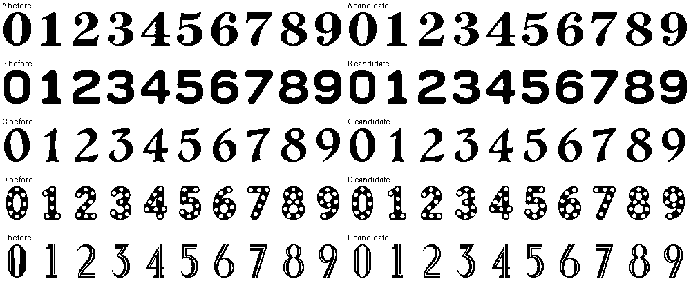
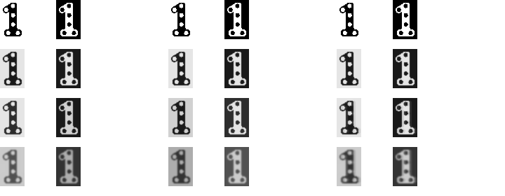

# 日期字形：离线仿真与压缩优化

这套工具分析字体栅格化和无损编码，不是 Note4 实机光学测量，也没有新增截图基线、hash 或质量门禁。
固件仍然只绘制原生 48px 黑白位图，不运行 Python、轮廓求解、SSIM 或字体解析器。

## 执行

```sh
# 完整搜索：5 个字高 × 50 个字形 × 10 个采样候选。
uv run --no-project tools/optimize-digit-font.py

# 使用已有 ESP-IDF 构建参数，编译真实 canvas，比较四组编码及其目标机器码。
uv run --no-project tools/measure-digit-codecs.py --recipe build-font-analysis/recipe.json

# 接受参数后生成固件数据；raster-settings.json 是可编辑参数，不是冻结契约。
uv run --no-project tools/generate-large-digits.py

# 普通算法、源图/参数/固件一致性和 Python/C++ 位级往返测试。
tools/test-digit-font.sh
ZECTRIX_DIGIT_SANITIZE=1 tools/test-digit-font.sh

# 真实界面预览及目标构建。
bun tools/ui-preview.ts --docs
source tools/activate-dev-env.sh
tools/build-firmware.sh
```

报告位于 `build-font-analysis/index.html`，包含原生对照、敏感性仿真、率失真散点图和所有候选的 JSON。
目标编码器测量位于 `build-font-codecs/report.json`。工具不自动修改固件参数；接受选择后才更新
`docs/design/date-digits/raster-settings.json` 并重新运行生成器。

源图和几何指标实现未变时，可以显式使用 `--measurements <report.json>` 复用几何测量，重新计算编码、Pareto 工作点和显示情形。
报告记录复用来源；源图或指标改变时必须重新完整计算。默认不复用，不以 hash 或冻结截图检查代替实际执行。

## 测量定义

每种风格对照自己的高分辨率源图，不把艺术字体强制拟合成无衬线字体。

| 指标 | 算法与含义 |
| --- | --- |
| 轮廓误差 | 4× 采样的对称边缘距离，报告均值和 p95，单位为目标像素 |
| 锯齿残差 | 字形与参考的有符号距离差，测量边缘带内的高频残差；保留参考自身的衬线和转角 |
| 笔画宽度代理 | 前景距离变换的局部脊线半径 × 2；不是精确的书法笔画分解 |
| 拓扑 | 8 连通墨迹、4 连通背景，比较连通分量与孔洞数 |
| 感知差异 | Gaussian-window SSIM，在字形区域而不是整页白边上取平均 |
| 锐度代理 | 合成直边的 10–90% ESF 宽度与对比度；不是符合 ISO 测量条件的实机 MTF |
| 易混外观 | 模拟条件下数字对的区域反射强度差异，列出最近的数字对；不是 OCR 或人类识别率 |

搜索 Lanczos/面积采样，以及 128、140、150、160、172 五种二值化阈值，字高为 24/32/40/48/64px。
先排除相对源图拓扑改变的候选，再报告失真与字节数的 Pareto 集。接受的候选必须不增加轮廓 p95 和综合失真；没有安全改善则保留原参数并报告原因。

当前工程目标为：

```
D = 轮廓 p95 + 0.5 × 锯齿残差 + 0.25 × 笔画宽度相对误差
    + 2 × 平均 SSIM 失真 + 最坏 SSIM 失真
J = D + 0.001 × 单字形编码字节数
```

权重是显式工程工作点，未经过人类主观实验验证；`--rate-weight` 可调整，不能把 J 当作普适清晰度分数。
编码器组合另行比较**载荷＋索引＋共享字典＋目标解码机器码**。目标机器码来自既有 ESP-IDF 的真实编译参数；最终链接占用仍以固件构建为准。
Python/C++ 宿主解码时间只是 CPU 成本的参考，不是 ESP32-S3 延迟或电池能耗；sanitizer 运行的时间不应用于性能结论。

## 显示情形与限制

仿真使用线性反射强度、Gaussian 扩散、旧画面残留和观看低通。
四组参数是未校准的敏感性情形，不对应实际温度、波形、全刷/局刷次数或屏幕寿命。
没有用假定参数证明真实残影或灰阶能力，也没有改动设备刷新波形。

- 对比理想、轻微扩散、历史残影和压力情形。
- 五种风格分别模拟 09→10、19→20、30→31，正/反色与四个旋转方向，共 480 组日期变化。
- 旋转仅置换像素，没有插值；当前扩散模型各向同性，不能推断真实屏幕方向差异。
- 报告假定 PPI 与观看距离下的像素角尺寸；默认 150/200/300 PPI、250/400mm 不是 Note4 实测数据。
- 页面的反射图按原生像素保存，不通过拉伸图像伪造平滑。
- AI 原图是参考形状，而非完美字体设计的真值。

实机校准需要固定照明、曝光、相机放大率和拍摄角度，分别记录清屏及局刷历史、温度和观察距离。
照片中的锐度包含镜头、传感器和图像处理影响，不能直接全部归因于屏幕。

## 信息论与编码选择

工具报告黑白边缘概率的经验熵，以及相邻上/左像素条件下的经验熵。
这些指标用于解释空间冗余，不是锐度指标，也不是含模型开销的可达到码长证明。
以实际编码字节数和逐像素解码一致性作最终比较。

已实现并实测：原始 1bpp、行像素 RLE、行 XOR 后 RLE、列像素 RLE、逐字形混合、4×4/8×8 共享块字典，以及整组 Deflate 参考方案。
块字典计入共享字典与 uint16 块索引；Deflate 计入载荷与字形索引，但仍需整组输出缓冲及解码器工作区，不能只凭压缩载荷最小就接入设备。
目前采用 raw/row-RLE/column-RLE，XOR 解码能力仅保留在离线比较和测试中，生成参数会使生产实例编译掉该分支。

在同一组最终采样参数下，真实 ESP32-S3 canvas 对象的测量如下（字节）：

| 编码组合 | 载荷 | 索引 | 日期绘制与解码机器码 | 合计估算 |
| --- | ---: | ---: | ---: | ---: |
| raw + 行 RLE | 7,249 | 300 | 653 | 8,202 |
| raw + 行 RLE + XOR | 6,818 | 300 | 725 | 7,843 |
| **raw + 行 RLE + 列 RLE** | **6,473** | **300** | **671** | **7,444** |
| 全部四种流式编码 | 6,398 | 300 | 755 | 7,453 |

四编码组合的载荷更小，但加入共享解码机器码后比列 RLE 组合多 9 字节，还需要 XOR 的前行状态。
因此选择列 RLE 组合；不把 75 字节载荷优势误认为整机空间优势。
表中包含 `LargeNumberWidth`、`LargeNumber` 及相关解码符号，不包含最终链接对齐；不是 MCU 延迟测量。

最终固件构建为 2,689,536 字节，比此前 2,690,112 字节减少 576 字节，最小应用分区剩余 456,192 字节（14.5%）。
字形数据从 7,510 降至 6,773 字节（约 9.8%）；新增绘制/解码机器码抵消部分节省，故不把载荷差值当作固件差值。
已运行 10 项 Python 测试、648 组 Python/C++ 逐位解码对照及 ASan/UBSan；本地化和显示集成 sanitizer 测试通过，生成 812 张真实宿主 UI 预览。
没有刷写设备，也没有将宿主时间或仿真锐度当作实机结论。





第二张图从上到下为四种情形，每行三组旧画面（空白、实黑、位移字形），每组左为正色、右为反色。
两张图均是离线生成图，不是屏幕照片。

在本次 48px 工作点，43 个字形获得拓扑安全的采样调整，综合工程失真均值从 0.9164 降到 0.8649（约 5.6%）。
E3–E9 在当前采样搜索中无法完整保留高分辨率细线的拓扑，继续使用原参数并显式告警；这不是“全部字体无锯齿”的证明。
要继续改善这些艺术字形，优先修改其源轮廓或提高字高，而不是仅凭更好的压缩算法恢复已丢失的信息。

## 参考

- [SSIM 原始研究](https://www.cns.nyu.edu/~lcv/pubs/makeAbs.php?loc=Wang03)：结构相似度，不等于字体识别实验。
- [FreeType 栅格化与 hinting 背景](https://freetype.org/autohinting/background.html)：覆盖率、网格对齐与黑白字形的关系。
- [Stanford 图像压缩课程](https://web.stanford.edu/class/ee398a/handouts.htm)：熵编码与率失真理论。
- [显示器锐度测量](https://www.imatest.com/solutions/display/)：显示器与拍摄链路的锐度问题。
- [墨水屏厂商说明](https://www.waveshare.com/wiki/4.2inch_e-Paper_Module_%28C%29_Manual)：温度、波形与局刷残影；不是 Note4 的校准参数。
