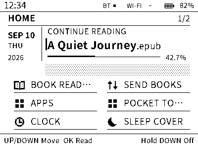
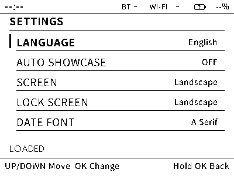
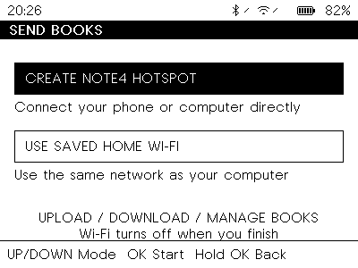
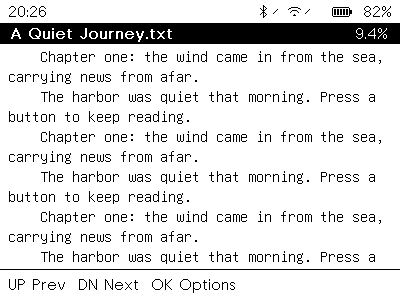
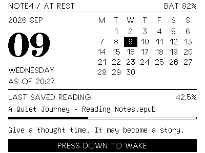

# Note4 quick start and hacker handbook

English | [简体中文](HANDBOOK_zh.md)

For Note4 Open Platform **v1.2.0**, an independent community firmware for the
black-and-white Note4: ESP32-S3, 16 MiB Flash, 8 MiB octal PSRAM and a 400×300
SSD2683 display. NOTE4C uses different hardware. This project is not the
manufacturer's firmware or cloud service.



The illustrations are rendered firmware screens; sample dates, books and
battery readings are illustrative. Downloaded HTML editions embed the images
and can be read offline or printed from a browser.

[TOC]

## 1. Choose and install firmware

All three configurations run on the **same Note4 hardware** and use the same
partition layout. Choose **Full** for everyday use.

| Configuration | Included | Language |
| --- | --- | --- |
| Full | Reader, USB/Wi-Fi file transfer, Apps, Pocket Tools, companion connectivity, clock and sleep covers | Chinese and English; Chinese on a new installation |
| Reader | Offline reader, USB library management, clock and sleep covers; radios and app runtime excluded | Chinese and English; Chinese on a new installation |
| Minimal | Clock, sleep dashboard/landscape/blank cover, settings, display gallery and diagnostics; reader, radios, USB manager and app runtime excluded | English |

Get the downloads from [GitHub Releases](https://github.com/Tinnci/zectrix-note4-platform/releases).
For a first Full installation, download:

- `zectrix-note4-v1.2.0-full.zip`: the complete segmented firmware.
- `zectrix-note4-v1.2.0-host-tools.zip`: USB transfer and app-packaging tools.
- `zectrix-note4-v1.2.0-library-init.zip`: optional first-time content storage.
- `SHA256SUMS`: checksums for the release downloads.

For another configuration, choose its `reader.zip` or `minimal.zip` instead.
The separate `*-app.bin` files are for application-image tooling; use the ZIP
for a complete USB installation.

**Back up your existing books, apps and pictures before flashing.** Ordinary
firmware ZIPs preserve the existing Note4 NVS/settings and content partitions
when the installed partition layout matches. An older/vendor/different layout
requires its own backup and migration; preservation is not guaranteed there.

1. Install [uv](https://docs.astral.sh/uv/getting-started/installation/).
   A firmware download does not require ESP-IDF or a C++ compiler.
2. Verify each downloaded file against its line in `SHA256SUMS`. On macOS,
   use `shasum -a 256 FILE`; on Linux, use `sha256sum FILE`. If you downloaded
   the entire set into one directory, run `shasum -a 256 -c SHA256SUMS`
   (macOS) or `sha256sum -c SHA256SUMS` (Linux). Stop if a checksum differs.
3. Extract the host-tools ZIP. From its directory, connect a USB **data** cable
   and run `uv run --script tools/usb-manager.py ports`. Note the Note4 port,
   for example `/dev/cu.usbmodem14301`, `/dev/ttyACM0` or `COM5`. Close any
   serial monitor using that port.
4. Extract the chosen firmware ZIP into its own empty directory, open a
   terminal there and replace `PORT` in this command:

```bash
uvx --from esptool==4.11.0 esptool.py --chip esp32s3 --port PORT write_flash @flash_args
```

Keep power connected until the write finishes. The device restarts into Home.
Keep all extracted files together: `flash_args` refers to their relative paths.
It writes the bootloader, partition table, factory application and OTA selection
as separate segments. Do not combine their gaps into an erase-filled image.

### Initialize a new library once

If Full/Reader reports unavailable content storage on a new installation,
extract the **library-init** ZIP into a separate directory and run the same
`write_flash @flash_args` command from that directory.

**Library initialization replaces every book, installed app and phone picture.**
It installs the bundled reading guide and preserves firmware and NVS settings.
Skip it for an ordinary upgrade or a switch between Full and Reader. Minimal
does not use the content filesystem. A mount error never triggers automatic
formatting; recover/export existing content before intentionally resetting it.

## 2. Three buttons, one navigation pattern

| Gesture | Action |
| --- | --- |
| UP / DOWN click | Move the selection; turn pages while reading |
| OK click | Open the selected item or perform its displayed action |
| Hold OK for 1.5 seconds | Back one level; cancel a loading page or an unconfirmed edit |
| Hold DOWN for 3 seconds | Save/close the active app, show the sleep cover and power down |
| Release DOWN, then press again | Wake after shutdown |

Home focus moves through the reading card, then the tiles from left to right
and top to bottom. Continue past the last tile to reach the next Home page.
**Settings** and **Tools** are on the second page in Full. Tools retains its
selected row when you return from a tool. New installations stay on Home;
automatic showcase is off by default.

```text
Home → Book Reader → Library → Reading → Options
     → Send Books → Network mode → Transfer session
     → Apps → Installed apps → Running app
     → Sleep Cover → Choose → Preview
     → Tools → USB Manager / Connectivity / diagnostics

OK opens a selection. Hold OK retraces one level.
Hold DOWN requests shutdown, including during loading or transfer.
```

Open **Settings → Language** to choose English or 简体中文. A saved preference
survives normal upgrades. **NOT SAVED** means the choice works for this boot
but could not be written; select it again to retry. Minimal supplies English.



The top bar shows local time, radio activity and battery state. A lightning
bolt means charging, a plug means external power, and `--%` means no usable
battery reading. A crossed radio is off; arrows indicate activity. A Bluetooth
connection icon alone does not establish companion authorization. See the
[status icon guide](STATUS_BAR.md) for all marks.

## 3. Put a book on Note4

### USB: Full or Reader

Open **Home → Tools → USB Manager** on Note4 and leave that screen open. Run
these commands from the extracted host-tools directory. Put your book there,
or give its full path; replace `PORT` with the detected device port.

```bash
uv run --script tools/usb-manager.py --port PORT info
uv run --script tools/usb-manager.py --port PORT put novel.epub
uv run --script tools/usb-manager.py --port PORT list
uv run --script tools/usb-manager.py --port PORT get novel.epub exported.epub
```

Uploads do not overwrite an existing filename. Use `put novel.epub --name
novel-2.epub` for another edition. Downloads also require a new local output
filename. OK on Note4 cancels the current USB operation; hold OK leaves the
manager and releases the library for reading. USB Manager is a serial tool,
so the device does not appear as a USB disk.

### Wi-Fi: Full



1. Connect external power or use a battery reading of at least 20%.
2. Open **Send Books → Create Note4 Hotspot**. Join the displayed `NOTE4-XXXX`
   network on your phone/computer, using the displayed 12-character code as
   the Wi-Fi password. Keep the connection when warned it has no Internet.
3. Open the displayed **http://** address in a browser and enter the same code.
4. Drag TXT/EPUB files onto the page, or choose files. Select **Upload & finish**.
5. Wait for completion. Wi-Fi turns off automatically; press OK on Note4 to
   open Book Reader. To manage more files, start a new Send Books session.

The page also downloads and deletes files. **Finish session** ends without
uploading; **Cancel upload** keeps files already completed. OK on an active
device session stops it; hold OK returns to network selection. A session also
ends after three idle minutes or fifteen minutes total.

**Use saved home Wi-Fi** works when credentials have already been provisioned;
join the same LAN and use the displayed address. Hotspot mode needs no saved
credentials. Offline/phone-only connectivity policies disable this service.
Use a trusted local network: the browser service uses HTTP, not Internet hosting.

### Supported books and capacity

Use UTF-8 `.txt` or unencrypted, reflowable `.epub` files. EPUB support covers
text, chapters and basic emphasis; CSS layouts, embedded fonts, images, DRM and
font-obfuscated EPUBs are unsupported. Export an unsupported book as UTF-8 TXT
or a simple EPUB. Common CJK glyphs and Latin text are supported; other glyphs
can appear as replacements.

The shared content partition is 4 MiB. The transfer page reports the usable
allowance after reserving filesystem space; the whole 4 MiB is not available
for one book. Book filenames allow at most 63 UTF-8 bytes with no path separators.
The reader lists the first 32 eligible filenames in byte order; the web library
can page through more. Keep the reading collection small and export finished books.

## 4. Read and resume



Choose **Book Reader**, select a book with UP/DOWN, then press OK. In a book,
UP goes to the previous page and DOWN to the next. OK opens options for 16px or
24px text, restarting the book and returning to the library. Hold OK returns
to the library even while a chapter is loading.

A successfully displayed page saves its position automatically. Home's
**Continue Reading** card restores the latest saved book and font size. Up to
eight recent book positions are retained. The percentage estimates text-byte
progress; reflowing the font can change it without losing your place.

The reader streams the source in small slices. A large EPUB chapter can take
longer to open or revisit; Back remains available. A brief full-screen flash
periodically cleans e-paper ghosting. Missing or changed books return to the
library with an explanation. Give a different edition a new filename so it
does not reuse the old edition's position.

## 5. Clock, pocket tools and sleep pictures

Open **Clock**, then OK to edit. UP/DOWN adjusts the current field; OK advances
through date, time and UTC offset to **Save date and time**. For China, use
UTC+08:00. Hold OK cancels. A missing/invalid RTC leaves the clock usable with
an explicit unset-time message; **RTC SAVE PENDING** calls for a later retry.
Retained time after power-off depends on the board's RTC backup supply.

Full's **Pocket Tools** includes a focus timer, month calendar and counter.
The timer continues while another app is open, but is silent and does not wake
the device. Timer/counter state is cleared by reboot or shutdown. The calendar
can browse months without changing the device clock.



Open **Sleep Cover**, select Dashboard, Landscape, Blank/Privacy or Phone
Picture, then press OK to save and preview. OK again sleeps; hold OK returns.
The final image stays visible without periodic refresh. Its date, weather,
reading progress and battery are a snapshot taken at shutdown.

For a personal picture, use the [Android companion](../android-companion/README.md)
to choose a photo, inspect its monochrome preview, and send it during a Full
Wi-Fi transfer session. Finish the transfer, then choose **Phone Picture** on
Note4. Remove the old saved picture explicitly before sending a replacement.
Picture transfer uses Wi-Fi; BLE carries small synchronization records.

The companion can also request city weather, synchronize time and exchange
reading progress. Install/build it using its README; these firmware downloads
do not include a production-signed Android APK. Pair locally through
**Tools → Connectivity** and approve the phone/device prompts. NFC enrollment
assists device selection; it does not skip pairing approval. On Note4, choose
**Use phone position** in the matching book's options to accept a returned
position. Receiving it never turns a page automatically.

## 6. Install a small application

Full's **Apps** runs `.zapp` packages and UTF-8 Lua scripts. Download the
`Calculator.zapp` and `Flashcards.zapp` example assets into your host-tools
directory, then open USB Manager:

```bash
uv run --script tools/usb-manager.py --port PORT app-put Calculator.zapp
uv run --script tools/usb-manager.py --port PORT app-list
uv run --script tools/usb-manager.py --port PORT app-get Calculator.zapp saved-calculator.zapp
uv run --script tools/usb-manager.py --port PORT app-remove Calculator.zapp
```

The last command removes that app; use it only when removal is intended.
Alternatively, drop `.zapp`/`.lua` files onto the Send Books web page. Leave
transfer mode, open **Home → Apps**, select an app and press OK. Hold OK exits
to the list. An app fault opens a recoverable error page; OK returns to the list.

Calculator uses UP/DOWN to change digits/operators and OK to advance.
Flashcards uses UP/DOWN to change cards and OK to show/hide the answer.
App state lasts until exit. Apps have bounded memory/instruction budgets and
declared display/input access; they have no file, radio or native-driver API.
Package author/version labels are self-declared, not signatures.

To make a package from a checkout:

```bash
uv run --script tools/zapp.py build apps/Calculator.app.json -o build-apps/Calculator.zapp
uv run --script tools/zapp.py inspect build-apps/Calculator.zapp
```

See [application packaging](ZAPP_PACKAGES.md) for metadata and
[the Lua interface](MICRO_APPS.md) for a complete small app. App filenames allow
47 UTF-8 bytes; Lua sources are at most 32 KiB. Reader/Minimal exclude Apps.

## 7. Recovery and common questions

| Symptom | Next step |
| --- | --- |
| No USB port or connection timeout | Use a data cable, close other serial tools, wake Note4 and check the port again. If necessary, hold OK (GPIO0) while resetting/powering up to enter the ESP32-S3 downloader, then release OK. |
| USB command says unavailable/busy | Open Tools → USB Manager. Exit reading or Wi-Fi transfer first. Minimal has no USB Manager. |
| Library unavailable after a first install | Initialize the library once. For an existing library, preserve/export data before considering a reset. |
| Upload says file exists | Choose a new filename, or export and explicitly delete the old file through the web page. |
| Upload was interrupted | Reconnect and list files before retrying. A timeout during the final save can have an uncertain outcome. |
| Hotspot connected but page unreachable | Stay on the no-Internet Wi-Fi connection, use the displayed HTTP address, and check VPN/cellular routing or LAN client isolation. |
| A tile is missing | Check the selected firmware profile; advance to the next Home page. Failed optional services may also omit their destinations. |
| The screen stays visible after power-off | This is normal e-paper retention. Release DOWN, then press it again to wake. |
| DOWN cannot wake USB-powered sleep | A button held past the roughly five-second release window cannot arm wake. Reset or power-cycle and release it after requesting sleep. |
| Clock or setting says not saved | Retry the save. Reading and navigation stay available; report persistent failures with diagnostics. |
| Unexpected reset or recovery page | OK/Back retries Home. Capture USB logs and inspect Tools → Device Info / Hardware Tests; reinstall the complete matching firmware ZIP if necessary. |

## 8. Build, inspect and contribute

Use the qualified **ESP-IDF 5.5.2** environment from
[Prerequisites](PREREQUISITES.md). Python tools use uv; HTTP integration uses
Bun. From the repository root:

```bash
source tools/activate-dev-env.sh
bash tools/test-host.sh
bash tools/build-firmware.sh --profile reader
bash tools/build-release.sh
```

The release command builds Full/Minimal/Reader, reports image sizes, records
source/toolchain identity and prepares ZIPs, example apps, offline guides and
`SHA256SUMS`. It does not flash a device. See [release operations](RELEASING.md)
for matrix builds and draft/publication commands.

With Full/Reader, a serial terminal can use `help`, `sysinfo`, `system health`,
`display status` and `display telemetry`. Close USB Manager's host client before
opening a serial monitor. Platform services own hardware; applications use the
[SDK](SDK_V1.md). The [architecture](ARCHITECTURE.md) retains one foreground
owner, deferred SceneManager transitions and clipped ViewPort drawing.

CrossPoint's [streaming reader](https://github.com/crosspoint-reader/crosspoint-reader),
local file sharing and sleep screens inform the product workflow. Flipper Zero's
[SceneManager/ViewPort](https://github.com/flipperdevices/flipperzero-firmware/tree/dev/applications/services/gui)
inform navigation and drawing ownership. Note4 uses independent implementations;
see the [reference study](FIRMWARE_UI_STUDY.md) and
[release notes](releases/v1.2.0.md).

Host/build checks cover software behavior. Physical NFC/BLE compatibility,
interrupted OTA rollback, display quality, RTC backup retention and standby
current have separate [qualification records](qualification/C2.1-COMPANION-INTEGRATION.md).
The current downloads provide USB installation; a trusted user-facing OTA
download/install flow is still tracked in GitHub #55.
