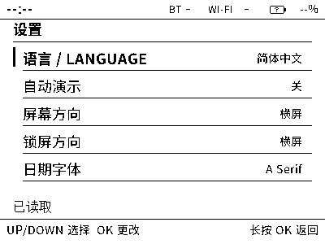
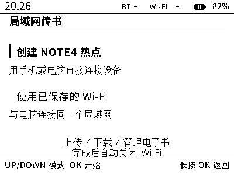

# Note4 快速上手与极客指南

[English](HANDBOOK.md) | 简体中文

适用于 Note4 Open Platform **v1.2.0**，这是面向黑白 Note4 的独立社区固件：
ESP32-S3、16 MiB Flash、8 MiB 八线 PSRAM、400×300 SSD2683 墨水屏。
NOTE4C 的硬件不同，不适用本固件。本项目不提供厂商固件或云服务。


插图来自固件渲染预览，日期、书籍和电量为示例。下载版 HTML 手册内嵌图片，
可以离线阅读，也可以通过浏览器打印。

[TOC]

## 1. 选择版本与安装固件

三种配置面向**同一种 Note4 硬件**，共用分区布局。日常使用推荐 **Full**。

| 配置 | 包含功能 | 界面语言 |
| --- | --- | --- |
| Full 全功能版 | 阅读器、USB/局域网传书、动态应用、随身工具、伴侣连接、时钟与待机画报 | 中英双语；首次安装默认中文 |
| Reader 离线阅读版 | 阅读器、USB 书库管理、时钟与待机画报；不编入无线网络和应用运行时 | 中英双语；首次安装默认中文 |
| Minimal 极简版 | 时钟、日历/山水/空白待机屏、设置、显示图库与诊断；不编入阅读器、无线网络、USB 管理和应用运行时 | 英文 |

从 [GitHub Releases](https://github.com/Tinnci/zectrix-note4-platform/releases)
下载。首次安装 Full 时，准备这些文件：

- `zectrix-note4-v1.2.0-full.zip`：完整的分段固件。
- `zectrix-note4-v1.2.0-host-tools.zip`：USB 传输与应用打包工具。
- `zectrix-note4-v1.2.0-library-init.zip`：可选的首次书库初始化包。
- `SHA256SUMS`：发布文件校验列表。

其他配置选择对应的 `reader.zip` 或 `minimal.zip`。单独的 `*-app.bin` 用于
应用镜像工具；完整 USB 安装请使用 ZIP。

**刷写前先备份已有书籍、应用和手机画报。** 普通固件 ZIP 在分区布局一致时保留
Note4 的 NVS 设置与内容分区。较早版本、厂商固件或其他分区布局需要先按其方式
备份和迁移，不能据此保证数据保留。

1. 安装 [uv](https://docs.astral.sh/uv/getting-started/installation/)。
   使用发布包不需要安装 ESP-IDF 或 C++ 编译器。
2. 对照 `SHA256SUMS` 检查下载文件。macOS 执行 `shasum -a 256 文件名`，
   Linux 执行 `sha256sum 文件名`，Windows PowerShell 执行
   `Get-FileHash -Algorithm SHA256 文件名`，与列表中对应的一行比较。如果已将全部发布
   文件放在同一目录，可以执行 `shasum -a 256 -c SHA256SUMS`（macOS）或
   `sha256sum -c SHA256SUMS`（Linux）。校验不一致时重新下载，不要继续刷写。
3. 解压 host-tools，用 USB **数据线**连接设备，在工具目录执行
   `uv run --script tools/usb-manager.py ports`。记录 Note4 串口，例如
   `/dev/cu.usbmodem14301`、`/dev/ttyACM0` 或 `COM5`，关闭占用它的串口监视器。
4. 将选中的固件 ZIP 解压到单独的空目录，在该目录打开终端，将下面的 `PORT`
   替换为实际串口后执行：

```bash
uvx --from esptool==4.11.0 esptool.py --chip esp32s3 --port PORT write_flash "@flash_args"
```

保留 `"@flash_args"` 两侧的引号，Windows PowerShell 中也按此写法执行。
写入完成前保持供电。设备重启后进入主页。不要移动解压后的单个文件，`flash_args`
使用它们的相对路径。它分段写入引导程序、分区表、出厂应用与 OTA 选择信息；
不要把段间空隙填充成擦除数据后合并刷入。

### 只在新书库上初始化一次

首次安装 Full/Reader 后，如果提示内容存储不可用，将 **library-init** ZIP
解压到另一个目录，在该目录执行相同的 `write_flash "@flash_args"` 命令。

**书库初始化会替换全部书籍、已安装应用和手机画报。** 它装入随包阅读指南，保留
固件与 NVS 设置。普通升级、Full 与 Reader 之间切换均不需要此步骤；Minimal
不使用内容文件系统。挂载失败不会自动格式化；已有数据应先恢复或导出，再决定
是否主动重置书库。

## 2. 三个按键，统一导航

| 操作 | 效果 |
| --- | --- |
| 短按 UP / DOWN | 上下选择；阅读时前后翻页 |
| 短按 OK | 打开选中项或执行屏幕提示的动作 |
| 长按 OK 1.5 秒 | 返回一级；取消加载或尚未确认的编辑 |
| 长按 DOWN 3 秒 | 保存并退出当前应用，显示待机画报后关机 |
| 松开 DOWN，再按一次 | 关机后唤醒 |

主页焦点先经过阅读概览，再按从左到右、从上到下经过磁贴。继续越过最后一项
即可进入下一页；Full 的**设置**和**工具**位于第二页。工具应用返回时保留原来的
选中行。新安装默认停留在主页，自动演示默认关闭。

```text
主页 → 电子书 → 书库 → 阅读 → 选项
     → 局域网传书 → 网络模式 → 传输会话
     → 应用 → 已安装列表 → 运行应用
     → 待机画报 → 选择 → 预览
     → 工具 → USB 管理 / 连接 / 诊断

短按 OK 进入，长按 OK 逐级返回。
加载、预览或传输期间也可以长按 DOWN 关机。
```

打开**设置 → 语言 / LANGUAGE**，选择简体中文或 English。普通升级保留语言
偏好。提示“未保存 / NOT SAVED”表示本次开机已生效，但写入失败；重新选择
可以重试。Minimal 仅提供英文界面。



顶部状态栏显示本地时间、无线活动与电量。闪电表示充电，插头表示外部供电，
`--%` 表示没有可用的电池读数。无线图标带斜线表示关闭，箭头表示传输活动。
蓝牙连接图标本身不代表伴侣授权已完成。全部符号见[状态栏说明](STATUS_BAR.md)。

## 3. 把第一本书传到 Note4

### USB 传书：Full 或 Reader

在设备上打开**主页 → 工具 → USB 管理**，保持这个页面。在解压的 host-tools
目录中执行下列命令，将 `PORT` 替换为实际串口。书籍可以放在工具目录，也可以
在命令中填写完整路径。

```bash
uv run --script tools/usb-manager.py --port PORT info
uv run --script tools/usb-manager.py --port PORT put novel.epub
uv run --script tools/usb-manager.py --port PORT list
uv run --script tools/usb-manager.py --port PORT get novel.epub exported.epub
```

上传不会覆盖同名文件。另一个版本可以使用 `put novel.epub --name novel-2.epub`。
导出时也应选一个尚不存在的本地文件名。设备短按 OK 取消当前 USB 操作；长按
OK 离开管理界面，释放书库后即可阅读。USB 管理使用串口工具，电脑不会显示
一个新的 U 盘。

### 局域网传书：Full



1. 接入外部电源，或确保电池有效读数至少为 20%。
2. 打开**局域网传书 → 创建 Note4 热点**。手机或电脑连接屏幕上的
   `NOTE4-XXXX` 网络，Wi-Fi 密码就是屏幕上的 12 位访问码。提示“无互联网”时
   仍保持连接。
3. 用浏览器打开设备显示的 **http://** 地址，输入同一个访问码。
4. 拖入 TXT/EPUB 文件，或点击选取文件，再选择 **Upload & finish**。
5. 等待传输完成，Wi-Fi 会自动关闭。在设备上按 OK 进入阅读器；继续管理文件
   时重新开启一次传书会话。

网页同时支持下载和删除。**Finish session** 不上传直接结束；**Cancel upload**
取消当前上传，已完成的文件仍然保留。设备在会话中短按 OK 停止，长按 OK 返回
模式选择。空闲三分钟或会话累计十五分钟也会自动结束。

**使用已保存的家庭 Wi-Fi** 适合已配置网络凭据的设备，手机/电脑须加入同一
局域网。没有保存凭据时直接使用热点。离线、仅手机连接策略会禁用传书服务。
请在可信局域网中使用；浏览器服务使用 HTTP，不用于公网托管。

### 书籍格式与容量

支持 UTF-8 `.txt` 和未加密、可重排的 `.epub`。EPUB 提供文字、章节和基本
强调样式，不支持 CSS 页面布局、内嵌字体、图片、DRM 或字体混淆加密。无法
打开的书籍可导出为 UTF-8 TXT 或简化 EPUB。支持常用中日韩汉字与拉丁文字，
缺失字形可能显示为替代方块。

内容分区共 4 MiB，书籍、应用和手机画报共享。传输界面会扣除文件系统预留
空间后显示可用容量，单本书不能用满全部 4 MiB。书名最多 63 个 UTF-8 字节，
不能包含路径分隔符。阅读器按文件名字节顺序显示前 32 本；网页可以分页管理
更多文件。建议保持精简的随身书库，读完后及时导出。

## 4. 阅读、字号与续读


打开**电子书**，UP/DOWN 选书，OK 打开。阅读时 UP 为上一页，DOWN 为下一页；
OK 打开选项，可切换 16px/24px 字号、从头阅读或返回书库。即使正在加载章节，
长按 OK 也能取消并回到书库。

页面成功显示后自动保存阅读位置。主页的**继续阅读**恢复最近保存的书和字号，
最多保留八本最近阅读记录。进度百分比按文本字节位置估算，字号重排后百分比
可能变化，但文字锚点保留。

阅读器分小段读取文本。较大的 EPUB 章节打开或回翻时可能需要更久，期间仍可
返回。偶尔的整屏闪动用于清理墨水屏残影。书籍被删除或长度变化时，续读会回到
书库并显示原因；不同版本请使用新文件名，避免复用旧版的阅读位置。

## 5. 时钟、随身工具与待机画报

打开**时钟**后按 OK 编辑。UP/DOWN 调整当前字段，OK 依次切换日期、时间和
UTC 偏移，最后选择**保存日期和时间**。中国时区使用 UTC+08:00；长按 OK
取消。RTC 缺失或时间无效时仍可进入时钟，并显示未设时间；提示 RTC 待保存时
可稍后重试。断电后的走时依赖板载 RTC 备用供电。

Full 的**随身工具**提供专注计时器、月历和计数器。离开工具去阅读时计时仍会
继续，但没有声音提醒，也不会唤醒休眠设备。计时与计数状态在重启或关机后清空。
浏览月历不会修改系统日期。


打开**待机画报**，选择日历仪表盘、山水画报、空白隐私屏或手机画报，按 OK
保存并预览；再次 OK 休眠，长按 OK 返回。最终画面在休眠期间保持静止，不会
定期刷新。日期、天气、阅读进度和电量均是关机时的快照。

使用个人画报时，在 [Android 伴侣端](../android-companion/README.md)选取照片，
检查黑白预览，再通过 Full 的 Wi-Fi 传输会话发送。结束传输后，在 Note4 选择
**手机画报**。替换图片前需主动移除已保存的旧画报。图片通过 Wi-Fi 传送，
BLE 用于小型同步记录。

伴侣端还可请求指定城市天气、同步时间、交换阅读进度。安装/编译方法见伴侣端
README；本固件下载集不包含正式签名的 Android APK。在 Note4 的**工具 →
连接**中开启本地配对，并确认手机和设备提示。NFC 辅助选择设备，不会跳过
配对授权。手机回传位置后，在相应书籍选项中选择**使用手机进度**才会跳转；
收到同步消息不会自动翻页。

## 6. 安装一个小应用

Full 的**应用**支持 `.zapp` 包和 UTF-8 Lua 脚本。将发布附件中的
`Calculator.zapp`、`Flashcards.zapp` 下载到 host-tools 目录，打开设备的
USB 管理，然后执行：

```bash
uv run --script tools/usb-manager.py --port PORT app-put Calculator.zapp
uv run --script tools/usb-manager.py --port PORT app-list
```

也可以在局域网传书网页中拖入
`.zapp`/`.lua`。退出传输界面，进入**主页 → 应用**，选中后按 OK 启动。
长按 OK 回到列表；应用出错时会显示可恢复的错误页，按 OK 返回列表。

Calculator 用 UP/DOWN 修改数字或运算符，OK 前进；Flashcards 用 UP/DOWN
切卡，OK 显示或隐藏答案。应用状态在退出时结束。运行时限制内存、指令配额
和已声明的显示/输入权限，不提供文件、无线或原生驱动 API。包中的作者与
版本是自行声明的元数据，不是数字签名。

需要导出已安装应用时，重新打开 USB 管理并执行：

```bash
uv run --script tools/usb-manager.py --port PORT app-get Calculator.zapp saved-calculator.zapp
```

需要卸载时，再执行
`uv run --script tools/usb-manager.py --port PORT app-remove Calculator.zapp`。

从源码目录制作应用包：

```bash
uv run --script tools/zapp.py build apps/Calculator.app.json -o build-apps/Calculator.zapp
uv run --script tools/zapp.py inspect build-apps/Calculator.zapp
```

元数据详见[应用打包说明](ZAPP_PACKAGES.md)，完整小应用示例见
[Lua 接口](MICRO_APPS.md)。应用文件名最多 47 个 UTF-8 字节，Lua 源文件
最多 32 KiB。Reader/Minimal 不包含动态应用。

## 7. 常见问题与恢复

| 现象 | 处理方法 |
| --- | --- |
| 没有串口，或连接超时 | 换数据线、关闭其他串口工具、唤醒设备后再查端口。必要时按住 OK（GPIO0）复位或重新上电，进入 ESP32-S3 下载模式，再松开 OK。 |
| USB 命令提示 unavailable/busy | 先打开工具 → USB 管理，退出阅读或 Wi-Fi 传输。Minimal 不含 USB 管理。 |
| 首次安装后书库不可用 | 初始化书库一次；已有书库应先保留/导出数据，再考虑重置。 |
| 提示文件已存在 | 改用新文件名，或先导出，再通过网页明确删除旧文件。 |
| 上传中断 | 重连后先查看列表，再决定是否重试。最后保存时超时可能已经完成，不能直接认定失败。 |
| 连上热点但打不开网页 | 保持无互联网 Wi-Fi 连接，使用设备显示的 HTTP 地址，检查 VPN/蜂窝网络路由或家庭网络的客户端隔离。 |
| 找不到某个磁贴 | 查看固件配置，并继续翻到下一主页。可选服务启动失败也可能隐藏对应入口。 |
| 关机后画面仍在 | 墨水屏会保留画面，这是正常现象。松开 DOWN，再按一次唤醒。 |
| USB 供电休眠后 DOWN 无法唤醒 | 关机后若持续按住超过约五秒，无法设置按键唤醒。复位或重新上电，下次请求休眠后及时松开按键。 |
| 时钟或设置提示未保存 | 重新保存。期间仍可阅读和导航；持续失败时记录诊断信息。 |
| 意外重启或出现恢复页 | 用 OK/返回重试主页，保存 USB 日志，并查看工具 → 设备信息/硬件测试；必要时重装对应的完整固件 ZIP。 |

## 8. 编译、诊断与开发

按[环境准备](PREREQUISITES.md)启用已验证的 **ESP-IDF 5.5.2**。Python 工具
使用 uv，HTTP 集成测试使用 Bun。在工程根目录执行：

```bash
source tools/activate-dev-env.sh
bash tools/test-host.sh
bash tools/build-firmware.sh --profile reader
bash tools/build-release.sh
```

发布命令编译 Full/Minimal/Reader，记录体积、源码与工具链信息，并生成固件
ZIP、示例应用、离线手册和 `SHA256SUMS`，不会刷写设备。矩阵构建、草稿与
发布操作见[发布指南](RELEASING.md)。

Full/Reader 可以通过串口终端执行 `help`、`sysinfo`、`system health`、
`display status`、`display telemetry`。打开串口监视器前先关闭 USB 管理的
电脑端客户端。硬件由平台服务管理，应用使用 [SDK](SDK_V1.md)。
[架构](ARCHITECTURE.md)保留单一前台所有者、延后处理的 SceneManager 转场
和有裁剪边界的 ViewPort 绘制。

[CrossPoint](https://github.com/crosspoint-reader/crosspoint-reader) 的流式阅读、
局域网传书与休眠画面，以及
[Flipper Zero SceneManager/ViewPort](https://github.com/flipperdevices/flipperzero-firmware/tree/dev/applications/services/gui)
为本项目提供设计参考，具体功能由 Note4 独立实现。参见
[参考研究](FIRMWARE_UI_STUDY.md)与[版本说明](releases/v1.2.0.md)。

Host 测试与编译验证软件行为。物理 NFC/BLE 兼容性、断电 OTA 回滚、显示质量、
RTC 断电保持和待机电流各有独立[验收记录](qualification/C2.1-COMPANION-INTEGRATION.md)。
当前发布包提供 USB 安装，可信的用户 OTA 下载与安装流程仍由 GitHub #55 跟踪。
