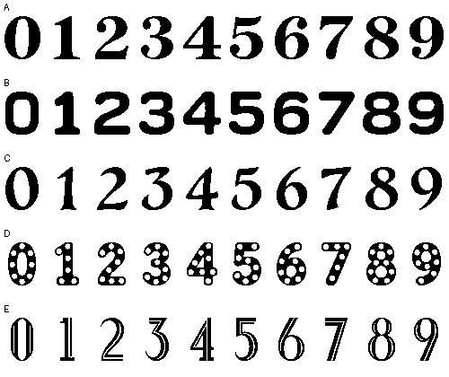
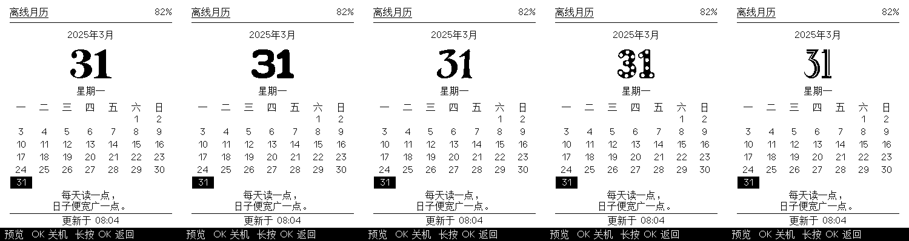

# 可选大日期字体

使用内置图像生成工具制作源图，Python/Pillow 离线转换为固件可直接绘制的 48px 黑白数字，并非 TTF。
设置 → 日期字体，确认键依次切换 A/B/C/D/E；保存成功才生效，重启和定时唤醒恢复同一选择。
默认 A，影响横竖屏日历锁屏的大日期，不影响阅读器字体、日历网格或远程页面。

- [A：书卷感衬线](a-editorial-serif.png)：曲线与衬线更有阅读器气质。
- [B：柔和几何](b-rounded-geometric.png)：较圆润、厚实，重视小尺寸辨识。
- [C：手写墨迹](c-ink-calligraphic.png)：笔画更有节奏，带书写感。
- [D：波点艺术](d-polka-dots.png)：粗圆轮廓与大圆点留白。
- [E：装饰艺术](e-art-deco.png)：几何骨架与双线细节。





锁屏对照来自实际固件宿主渲染，不是图像生成的界面效果图。

运行 `uv run --no-project tools/generate-large-digits.py` 可重新转换。
按墨迹裁边，使用可编辑的 [采样参数](raster-settings.json) 进行 Lanczos/面积采样和二值化，只保留 0–9。
每个字形独立比较 1bpp、行 RLE 与列 RLE，选择较小的编码；转换时逐字形解码对比原始像素。
50 个字形原始位图 9,966 字节，最终载荷 6,473 字节、索引 300 字节，总计 **6,773 字节**，比此前 7,510 字节减少约 9.8%。
运行时流式绘制，不分配解压缓冲、无堆分配、不解析字体；XOR 差分仅保留为离线对比，生产实例不启用。
原图仅用于离线转换，不进入固件。宿主预览覆盖五风格 × 01–31 × 横竖屏 × 中英文；`bun tools/ui-preview.ts --docs` 重新生成，搜索 `font-a` 至 `font-e` 对比。
字形质量、仿真情形、目标机器码测量与限制见 [字体优化说明](../../FONT_OPTIMIZATION.md)。
当前 ESP32-S3 构建为 **2,689,536 字节**，比此前五字体版本的 2,690,112 字节减少 576 字节。
最小应用分区剩余 456,192 字节（14.5%）；实际链接节省量计入新增解码代码与对齐，不直接等同于载荷差值。
数字间距按实际笔画边界调整，不再给窄数字 1 留完整等宽空框。
大图的细节与灰阶边缘不等于实际墨水屏的显示效果；请以原生尺寸预览为准，残影与刷新效果仍需实机确认。

## D/E 实际生成提示词

两个请求共用：

```text
Use case: stylized-concept
Asset type: numeral glyph atlas for 48px monochrome e-paper calendar firmware.
Primary request: an original artistic numeral typeface, a clean atlas with EXACTLY ten large black numerals on pure white, no labels or other text.
Composition: square canvas, five equal columns and two equal rows. Top row "0 1 2 3 4"; bottom row "5 6 7 8 9". Each numeral centered in its own cell, same cap height, very generous whitespace between glyphs, all glyphs fully visible. Crisp flat black and white shapes, no shadows, no background texture. Legible at small 48px height, strong strokes and open counters.
```

D 追加：

```text
Style: joyful polka-dot pop art. Thick rounded recognizable numeral silhouettes pierced by a few bold circular white polka dots; dots evenly spaced, large enough to survive downsampling, not tiny stippling. Keep the outer numeral silhouette strong.
```

E 追加：

```text
Style: elegant 1920s Art Deco numerals. Architectural geometric shapes, stepped terminals, strong thick strokes contrasted with robust thinner strokes, sophisticated stylized curves, no fragile hairlines. Original design, not a replica of a named font.
```

## 实际生成提示词

三个请求共用以下提示词，再分别追加 A／B／C 的风格说明。

```text
Use case: stylized-concept. Asset type: numeral typeface design specimen for a 300x400 / 400x300 monochrome e-ink calendar, eventual digit ink height 48px. Create an original professionally art-directed numeral alphabet, not a generic system-font screenshot. Pure white background, solid black shapes, flat front-facing high contrast. No device frames, no paper texture, no shadows, gradients, colors, logos or watermarks. Layout: a tiny single-letter variant label at top; a large central hero date "31" with OPTICALLY TIGHT spacing, close but not touching; below show the exact full numeral alphabet "0 1 2 3 4" on one row and "5 6 7 8 9" on another, five glyphs per row; bottom smaller tightly spaced date specimens "09  28  11  20". Every numeral must be exact and in the SAME original design system, upright readable and recognizable. Use proportional ink-aware spacing: the narrow 1 must NOT sit inside a wide invisible monospaced box. No added words or text. All digits should have sufficient stroke weight, open counters and robust details to survive monochrome reduction to 48px ink height. Black-and-white specimen board only, with balanced clean margins; NOT pixel art, NOT upscaled low-resolution bitmap glyphs, NOT Roboto Condensed, NOT seven-segment LCD.
```

### A

```text
Label (verbatim): "A". Style: elegant bookish slab-serif display numerals, warm editorial calendar typography. Moderate-low stroke contrast, substantial gently bracketed short serifs, expressive curved 2 and 3, broad oval 0 and rounded 8, dignified 1 with compact top flag and short solid foot. Slightly wider, beautifully drawn, not condensed or narrow industrial grotesk. Calm contemporary literary feeling, sophisticated but not hairline fashion Didone. Optical spacing between 3 and 1 is extremely important: compact contiguous date, not two isolated glyphs.
```

### B

```text
Label (verbatim): "B". Style: original soft geometric display numerals, rounded substantial almost-monoline strokes, slightly squared oval counters, subtle friendly terminal cuts, strong character like carefully designed contemporary product typography. Moderate width, not condensed. Round-bodied 0, 3 and 8, open 4, a distinctive curved-foot 1 whose actual ink sits close to its neighbor. Clear and warm, not childish bubble lettering, not generic Helvetica. Date "31" is a tightly kerned single visual unit.
```

### C

```text
Label (verbatim): "C". Style: expressive but highly controlled ink-written editorial numerals, contemporary calligraphic display lettering. Clean solid black brush-like silhouettes with gently angled terminals and subtle lively stroke modulation; no rough texture or splatters. Mostly upright, slightly human asymmetric curves, strong generous 0 and 8 counters, lively curved 2/3, compact distinctive 1. Stroke widths remain robust, no hairlines, no swashes crossing neighbors. Sophisticated quiet sketchbook/calendar personality, clearly unlike a condensed sans serif or an italic word-processor font. Very tight natural ink-aware date spacing.
```
